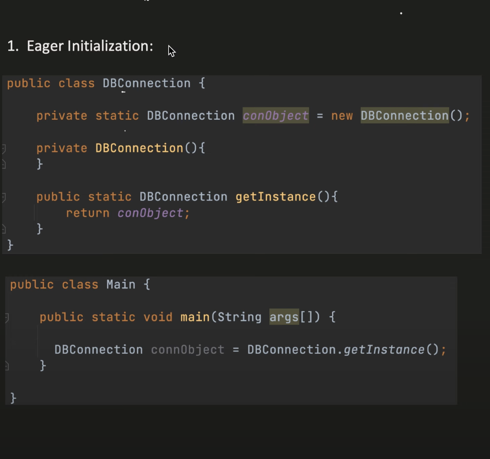
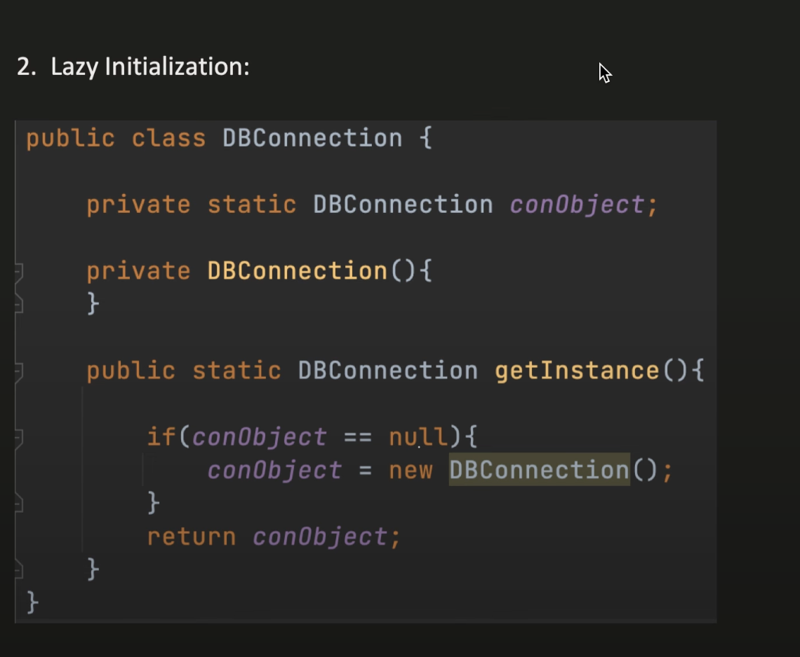
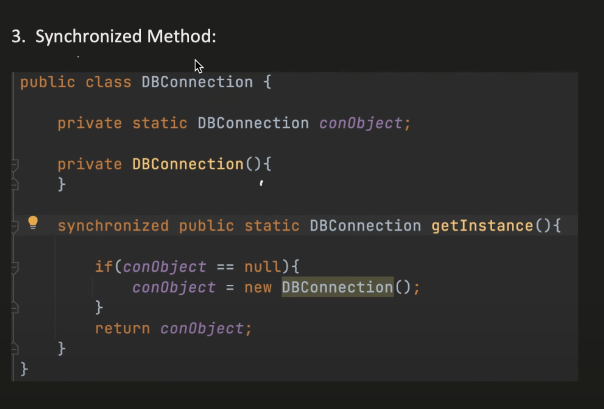

# Singleton Design Pattern

4 ways to achieve this:
* Eager
* Lazy
* Synchronized method
* Double Locking (used in industry)

### Eager

### Lazy

**Cons**

* If two threads came simultaneously, it will create two objects.

### Synchronized

**Cons:**
* If their are 1000s thread, it will lock for everyone, it is expensive.

### Double Locking

