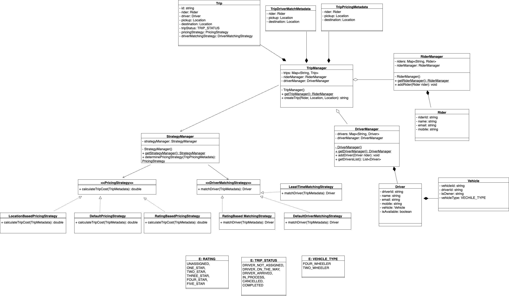

## Class Diagram

## References

- https://github.com/anomaly2104/lld-cab-booking-ola-uber-grab-lyft
- https://github.com/amarlearning/ride-sharing-low-level-design/tree/master
- https://github.com/keertipurswani/Uber-Ola-Low-Level-Design/tree/c9e7cbe0d555b70272d2f480027aad523c6ddf2d

## Youtube
Keerti Purswani:
https://www.youtube.com/watch?v=a-F45Jov0Ck&list=PLliXPok7Zonm0trweRA2UeSTTLVYiPzNG&index=3